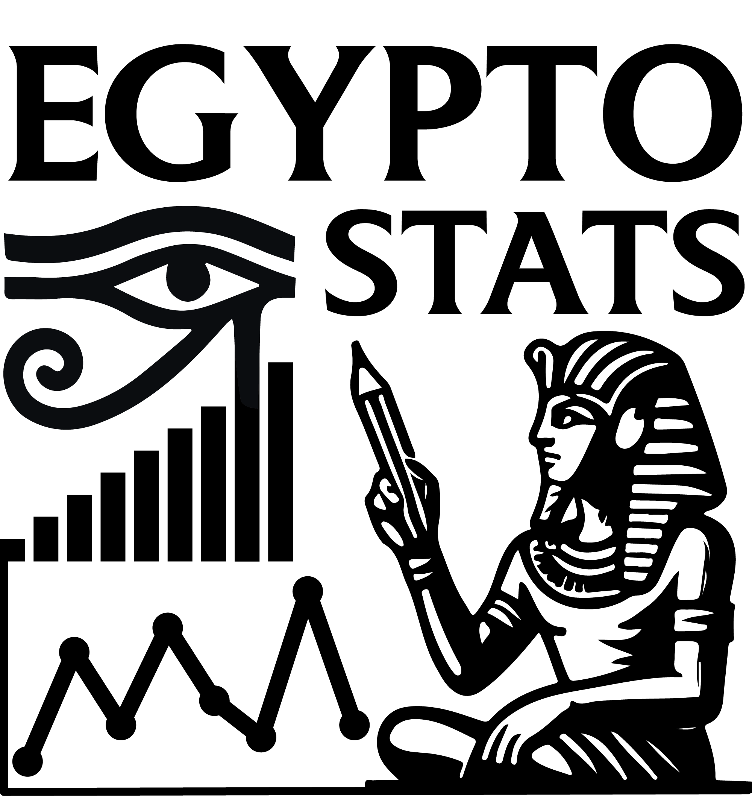

```{=html}
<style type="text/css">
.title {
  display: none;
}

#getting-started img {
  margin-right: 10px;
}

</style>
```
<div class="row" style="padding-top: 30px;">

<div class="col-sm-6">

# **EgyptoStats**

This is a site of all projects by Markus Kutschka, combining statistical analysis in Egyptology.


